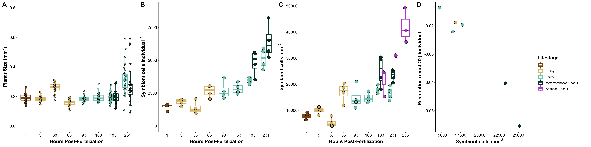

Script to analyze larval size, symbiont density, and examine correlations between physiological responses.  

# **Setup**  

Set up workspace, set options, and load required packages.    
```{r}
knitr::opts_chunk$set(echo = TRUE, warning = FALSE, message = FALSE)
```

```{r setup, include = FALSE}
## install packages if you dont already have them
if (!require("tidyverse")) install.packages("tidyverse")
if (!require("ggplot2")) install.packages("ggplot2")
if (!require("RColorBrewer")) install.packages("RColorBrewer")
if (!require("car")) install.packages("car")
if (!require("emmeans")) install.packages("emmeans")
if (!require("multcomp")) install.packages("multcomp")
if (!require("knitr")) install.packages("knitr")
if (!require("kableExtra")) install.packages("kableExtra")
if (!require("lme4")) install.packages("lme4")
if (!require("GGally")) install.packages("GGally")
if (!require("lmerTest")) install.packages("lmerTest")
if (!require("cowplot")) install.packages("cowplot")

# load packages
library(tidyverse)
library(ggplot2)
library(RColorBrewer)
library(car)
library(emmeans)
library(multcomp)
library(knitr)
library(kableExtra)
library(lme4)
library(GGally)
library(lmerTest)
library(cowplot)
library(Hmisc)
```


# **1. Larval Size**  

## Import and manipulate data
```{r}
# Larval size data
size <- read_csv("Mcap2020/Data/Physiology/Size/larval_size.csv")

#metadata
metadata <- read_csv("Mcap2020/Data/lifestage_metadata.csv")

size <- left_join(size, metadata)
size$hpf <- as.factor(size$hpf)
```

Prep data frame.   
```{r}
# Calculate mean counts for each sample
size <- size %>%
  dplyr::select(tube.ID, lifestage, replicate, `area (mm)`, hpf, group)%>%
  drop_na()%>% #remove na's that could not be measured
  rename(area=`area (mm)`) #rename column

size$lifestage<-as.factor(size$lifestage)
```

## Plotting  

Plot data with mean and standard error for each lifestage.  
```{r}
size %>%
  ggplot(aes(x = lifestage, y = area, color = lifestage)) +
  labs(x = "",y = "Mean Larval Size (mm^2)") +
geom_jitter(width = 0.1) +                                            # Plot all points
  stat_summary(fun.data = mean_cl_normal, fun.args = list(mult = 1),    # Plot standard error
               geom = "errorbar", color = "black", width = 0.5) +
  stat_summary(fun = mean, geom = "point", color = "black") + # Plot mean
  theme_classic()
```

Present means and standard error of each group and save summary table

```{r}
size%>%
  group_by(lifestage, hpf)%>%
  summarise(n=length(area),
            Mean=format(round(mean(area), 3), 3), 
            SE=format(round(sd(area)/sqrt(length(area)),3),3))%>%
  rename(Lifestage=lifestage, HPF=hpf)%>%
  kbl(caption="Descriptive statistics of larval size across ontogeny")%>%
  kable_classic(full_width=FALSE, html_font="Arial")%>%
  row_spec(0, bold = TRUE) 

#need to output to csv 
size%>%
  group_by(lifestage, hpf)%>%
  summarise(n=length(area),
            Mean=format(round(mean(area), 3), 3), 
            SE=format(round(sd(area)/sqrt(length(area)),3),3))%>%
  rename(Lifestage=lifestage, HPF=hpf)%>%
  write_csv(., "Mcap2020/Output/Physiology/larval_size_table.csv")
```


Plot data as a scatterplot   
```{r}
size$hpf<-as.factor(size$hpf)
size_plot<-size %>%
    ggplot(., aes(x = hpf, y = area)) +
    #geom_boxplot(outlier.size = 0) +
    geom_smooth(method="loess", se=TRUE, fullrange=TRUE, level=0.95, color="black") +
    geom_point(aes(fill=group, group=group), pch = 21, size=4, position = position_jitterdodge(0.1)) + 
    xlab("Hours Post-Fertilization") + 
    scale_fill_manual(name="Lifestage", values=c("#8C510A", "#DFC27D","#80CDC1", "#003C30"))+
    ylab(expression(bold(paste("Planar Size (mm"^2, ")"))))+
    ylim(0,1)+
    theme_classic() + 
    theme(
      legend.position="right",
      axis.title=element_text(face="bold", size=14),
      axis.text=element_text(size=12, color="black"), 
      legend.title=element_text(face="bold", size=14), 
      legend.text=element_text(size=12)
      ); size_plot

#EGG: #8C510A
#EMBRYO: #DFC27D
#LARVAE: #80CDC1
#RECRUIT: #003C30
```

## Plot data as box plot  
```{r}
size_plot2<-size %>%
    ggplot(., aes(x = hpf, y = area)) +
    geom_boxplot(aes(color=group), outlier.size = 0, lwd=1) +
    geom_point(aes(fill=group), pch = 21, size=2, position = position_jitterdodge(0.1)) + 
    xlab("Hours Post-Fertilization") + 
    scale_fill_manual(name="Lifestage", values=c("#8C510A", "#DFC27D","#80CDC1", "#003C30"))+
    scale_color_manual(name="Lifestage", values=c("#8C510A", "#DFC27D","#80CDC1", "#003C30"))+
    ylab(expression(bold(paste("Planar Size (mm"^2, ")"))))+
    ylim(0, 0.8)+
    theme_classic() + 
    #geom_text(label="A", x=1, y=2500, size=4, color="black")+ #egg
    #geom_text(label="A", x=2, y=2500, size=4, color="black")+ #embryo 1
    #geom_text(label="A", x=3, y=2500, size=4, color="black")+ #larvae 1
    #geom_text(label="AB", x=4, y=4100, size=4, color="black")+ #larvae 2
    #geom_text(label="AB", x=5, y=4100, size=4, color="black")+ #larvae 3
    #geom_text(label="AB", x=6, y=4100, size=4, color="black")+ #larvae 4
    #geom_text(label="BC", x=6.8, y=4500, size=4, color="black")+ #larvae 5
    #geom_text(label="CD", x=7.2, y=6500, size=4, color="black")+ #recruit 1
    #geom_text(label="D", x=7.8, y=6500, size=4, color="black")+ #larvae6
    #geom_text(label="D", x=8.2, y=8700, size=4, color="black")+ #recruit2
    theme(
      legend.position="right",
      axis.title=element_text(face="bold", size=14),
      axis.text=element_text(size=12, color="black"), 
      legend.title=element_text(face="bold", size=14)
      ); size_plot2
```

## Statistical analysis  

Run lmer on cells per larvae by sampling point, specified by sequence of samples taken (life stage, hpf). Use tube ID as random effect.       
```{r}
size_model<-lmer(area~lifestage + (1|tube.ID), data=size)
summary(size_model)
qqPlot(residuals(size_model))
leveneTest(residuals(size_model)~lifestage, data=size)
anova(size_model, type=2)
```

Violation in normality and variance assumptions. Conduct non-parametric test (Kruskal Wallis).  

```{r}
kruskal.test(area~lifestage, data=size)
```

Significant difference in size between lifestages.   

View posthoc comparisons for differences between lifestages.  

```{r}
emm = emmeans(size_model, ~ lifestage)
cld(emm, Letters=c(LETTERS)) #letter display
pairs(emm)
```


# **2. Symbiont Density**  

## Symbiont density per individual  

### Import and manipulate data  
```{r}
# Cell count data
sym_counts <- read_csv("Mcap2020/Data/Physiology/CellDensity/symbiont.counts.csv")

sym_counts <- left_join(sym_counts, metadata)
sym_counts$hpf <- as.factor(sym_counts$hpf)
```

Calculate cells and normalize to either planar size (eggs through metamorphosed recruits) or surface area (attached recruits)   
```{r}
# Calculate mean counts for each sample
df <- sym_counts %>%
  dplyr::select(tube.ID, num.squares, matches("count[1-6]")) %>%
  gather("rep", "count", -tube.ID, -num.squares) %>%
  group_by(tube.ID, num.squares) %>%
  summarise(mean_count = mean(count, na.rm = TRUE))

#match in identifying information
df$lifestage<-sym_counts$lifestage[match(df$tube.ID, sym_counts$tube.ID)]
df$total.volume.ul<-sym_counts$total.volume.ul[match(df$tube.ID, sym_counts$tube.ID)]
df$num.individuals<-sym_counts$num.individuals[match(df$tube.ID, sym_counts$tube.ID)]
df$surface.area<-sym_counts$surface.area[match(df$tube.ID, sym_counts$tube.ID)]
df$hpf<-sym_counts$hpf[match(df$tube.ID, sym_counts$tube.ID)]
df$group<-sym_counts$group[match(df$tube.ID, sym_counts$tube.ID)]
df$lifestage<-as.factor(df$lifestage)
df$group<-as.factor(df$group)

# Normalize counts by homogenat volume and surface area
df <- df %>%
  mutate(cells.mL = mean_count * 10000 / num.squares,
         cells = cells.mL * (total.volume.ul/1000),
         cells.ind = cells / num.individuals, 
         cells.mm = cells / surface.area)

sym_counts<-df
```

### Plotting  

Plot data with mean and standard error for larvae through metamorphosis (these counts have cells/individual). Plot attached recruits separately, these values are in cells per mm2. We will plot cells per unit surface area for all stages in later analyses.   

Display cells per individual.  
```{r}
sym_counts %>%
  filter(!group=="Attached Recruit")%>%
  ggplot(aes(x = lifestage, y = cells.ind, color = lifestage)) +
  labs(x = "",y = "Cell Density per larva") +
geom_jitter(width = 0.1) +                                            # Plot all points
  stat_summary(fun.data = mean_cl_normal, fun.args = list(mult = 1),    # Plot standard error
               geom = "errorbar", color = "black", width = 0.5) +
  stat_summary(fun = mean, geom = "point", color = "black") + # Plot mean
  theme_classic()
```

Display cell density per mm2 in attached recruit plugs. Plug 1 = 48 hps, Plug 2 = 72 hps, Plug 3 = 96 hps   
```{r}
sym_counts %>%
  filter(group=="Attached Recruit")%>%
  ggplot(aes(x = lifestage, y = cells.mm, color = lifestage)) +
  labs(x = "",y = "Cell Density per mm2") +
geom_jitter(width = 0.1) +                                            # Plot all points
  #stat_summary(fun.data = mean_cl_normal, fun.args = list(mult = 1),    # Plot standard error
               #geom = "errorbar", color = "black", width = 0.5) +
  #stat_summary(fun.y = mean, geom = "point", color = "black") + # Plot mean
  theme_classic()
```

Present means and standard error of each group and save summary table.  

```{r}
sym_counts%>%
  group_by(group, hpf, lifestage)%>%
  summarise(n=length(cells.ind),
            Mean=format(round(mean(cells.ind), 0), 0), 
            SE=format(round(sd(cells.ind)/sqrt(length(cells.ind)),0),0))%>%
  rename(Lifestage=group, HPF=hpf)%>%
  kbl(caption="Descriptive statistics of Symbiodiniaceae cell densities per larva across ontogeny")%>%
  kable_classic(full_width=FALSE, html_font="Arial")%>%
  row_spec(0, bold = TRUE) 

sym_counts%>%
  group_by(group, hpf, lifestage)%>%
  summarise(n=length(cells.mm),
            Mean=format(round(mean(cells.mm), 0), 0), 
            SE=format(round(sd(cells.mm)/sqrt(length(cells.mm)),0),0))%>%
  rename(Lifestage=group, HPF=hpf)%>%
  kbl(caption="Descriptive statistics of Symbiodiniaceae cell densities per mm2 across ontogeny")%>%
  kable_classic(full_width=FALSE, html_font="Arial")%>%
  row_spec(0, bold = TRUE) 

#need to output to csv 
sym_counts%>%
  group_by(group, hpf, lifestage)%>%
  summarise(n=length(cells.ind),
            Mean=format(round(mean(cells.ind), 0), 0), 
            SE=format(round(sd(cells.ind)/sqrt(length(cells.ind)),0),0))%>%
  rename(group=group, HPF=hpf)%>%
  write_csv(., "Mcap2020/Output/Physiology/cell_density_table.csv")
```

Plot data as a scatterplot   
```{r}
sym_counts$hpf<-as.numeric(as.character(sym_counts$hpf))

symb_plot<-sym_counts %>%
    filter(!group=="Attached Recruit")%>%
    droplevels()%>%
    ggplot(., aes(x = hpf, y = cells.ind)) +
    #geom_boxplot(outlier.size = 0) +
    geom_smooth(method="lm", se=TRUE, fullrange=TRUE, level=0.95, color="black") +
    geom_point(aes(fill=group, group=group), pch = 21, size=4, position = position_jitterdodge(5)) + 
    xlab("Hours Post-Fertilization") + 
    scale_fill_manual(name="Lifestage", values=c("#8C510A", "#DFC27D","#80CDC1", "#003C30"))+
    ylab(expression(bold(paste("Symbiont cells individual"^-1))))+
    ylim(0,9000)+
    theme_classic() + 
    theme(
      legend.position="right",
      axis.title=element_text(face="bold", size=14),
      axis.text=element_text(size=12, color="black"), 
      legend.title=element_text(face="bold", size=14), 
      legend.text=element_text(size=12)
      ); symb_plot

#EGG: #8C510A
#EMBRYO: #DFC27D
#LARVAE: #80CDC1
#RECRUIT: #003C30
#ATTACHED: #BA55D3

```

Plot data as box plot  
```{r}
symb_plot2<-sym_counts %>%
    filter(!group=="Attached Recruit")%>%
    droplevels()%>%
    ggplot(., aes(x = as.factor(hpf), y = cells.ind)) +
    geom_boxplot(aes(color=group), outlier.size = 0, lwd=1) +
    #geom_smooth(method="loess", se=TRUE, fullrange=TRUE, level=0.95, color="black") +
    geom_point(aes(fill=group), pch = 21, size=4, position = position_jitterdodge(0.2)) + 
    xlab("Hours Post-Fertilization") + 
    scale_fill_manual(name="Lifestage", values=c("#8C510A", "#DFC27D","#80CDC1", "#003C30"))+
    scale_color_manual(name="Lifestage", values=c("#8C510A", "#DFC27D","#80CDC1", "#003C30"), guide="none")+
    ylab(expression(bold(paste("Symbiont cells individual"^-1))))+
    ylim(0,9000)+
    theme_classic() + 
    theme(
      legend.position="right",
      axis.title=element_text(face="bold", size=14),
      axis.text=element_text(size=12, color="black"), 
      legend.title=element_text(face="bold", size=14)
      ); symb_plot2

```

### Statistical analysis  

Run ANOVA on cells per larvae by sampling point, specified by sequence of samples taken (life stage, hpf).    

```{r}
sym_ind_model_data<-sym_counts%>%
      filter(!group=="Attached Recruit")%>%
      droplevels()

sym_ind_model<-aov(cells.ind~lifestage, data=sym_ind_model_data)
summary(sym_ind_model)
qqPlot(residuals(sym_ind_model))
leveneTest(residuals(sym_ind_model)~lifestage, data=sym_ind_model_data)
```

Both normality and homogeneity of variance pass.   

There is a significant effect of lifestage on cell densities. View posthoc comparisons for differences between lifestages.  

```{r}
emm = emmeans(sym_ind_model, ~ lifestage)
cld(emm, Letters=c(LETTERS)) #letter display
pairs(emm)
```

Output data to file.  

```{r}
sym_counts %>%
  write_csv(., file = "Mcap2020/Output/Physiology/calculated_densities.csv")
```


## Symbiont density per unit size  

### Data manipulation and correlation  

First, test for correlation between symbiont cell density and larval size to see if there is a relationship.  

Generate data frame with summarised size and cell density information for each time point from eggs to metamorphosed recruits, because we have data for size and counts for each sample. We do not include attached recruits here yet, becuase we cannot calculate densities per individual.  

```{r}
#read in data frame generated in previous chunk 
sym_counts<-sym_counts%>%
  dplyr::select(tube.ID, lifestage, group, hpf, cells.ind, cells.mm)

#grab size data
area<-size%>%
  group_by(tube.ID)%>%
  summarise(mean_area=mean(area, na.rm=TRUE))

area$tube.ID<-as.factor(area$tube.ID)
sym_counts$hpf<-as.factor(sym_counts$hpf)

corr<-left_join(sym_counts, area)
```

Generate number of symbiont cells per mm^2 area for each tube.    
```{r}
corr<-corr%>%
  mutate(mean_area_2=mean_area*2)%>%
  mutate(counts_area=cells.ind/mean_area_2)%>%
  mutate(counts_area=ifelse(is.na(counts_area), cells.mm, counts_area)) #add attached recruit data already calculated as cells per mm2
```

Plot correlation between cell counts (cells per individual) and size (area mm^2).  

```{r}
correlation<-corr %>%
    filter(!group=="Attached Recruit")%>%
    ggplot(., aes(x = mean_area_2, y = cells.ind)) +
    #geom_smooth(method="lm", se=TRUE, fullrange=TRUE, level=0.95, color="black", fill="gray") +
    geom_point(aes(fill=group), pch = 21, size=4) + 
    xlab(expression(bold(paste("Larval Size (mm"^2, ")")))) + 
    scale_fill_manual(name="Lifestage", values=c("#8C510A", "#DFC27D","#80CDC1", "#003C30"))+
    scale_color_manual(name="Lifestage", values=c("#8C510A", "#DFC27D","#80CDC1", "#003C30"))+
    xlab(expression(bold(paste("Individual Size (mm"^2, ")"))))+
    ylab(expression(bold(paste("Symbiont cells individual"^-1))))+
    #ylim(0, 9000)+
    theme_classic() + 
    theme(
      legend.position="none",
      axis.title=element_text(face="bold", size=14),
      axis.text=element_text(size=12, color="black"), 
      legend.title=element_text(face="bold", size=14)
      ); correlation
```

Test relationship with a spearman correlation.  

```{r}
cor.test(corr$mean_area, corr$cells.ind, method=c("spearman"))
```

Significant correlation between size and cell counts.  r=0.37, p=0.017   

### Plotting  

Plot cells per mm^2 as a boxplot.  

```{r}
#order for creating a legend for all plots 
corr$group <- factor(corr$group, levels = c("Egg", "Embryo", "Larvae", "Metamorphosed Recruit", "Attached Recruit"))

cells_size_plot<-corr %>%
    ggplot(., aes(x = hpf, y = counts_area)) +
    geom_boxplot(aes(color=group), outlier.size = 0, lwd=1) +
    geom_point(aes(fill=group), pch = 21, size=4, position = position_jitterdodge(0.4)) + 
    xlab("Hours Post-Fertilization") + 
    scale_fill_manual(name="Lifestage", values=c("#8C510A", "#DFC27D","#80CDC1", "#003C30", "#BA55D3"), guide="none")+
    scale_color_manual(name="Lifestage", values=c("#8C510A", "#DFC27D","#80CDC1", "#003C30", "#BA55D3"))+
    ylab(expression(bold(paste("Symbiont cells mm"^-2))))+
    #ylim(2000, 35000)+
    theme_classic() + 
    theme(
      legend.position="right",
      axis.title=element_text(face="bold", size=14),
      axis.text=element_text(size=12, color="black"), 
      legend.title=element_text(face="bold", size=14)
      ); cells_size_plot

```

Plot as linear relationship.  

```{r}
cells_size_plot2<-corr %>%
    ggplot(., aes(x = as.numeric(as.character(hpf)), y = counts_area)) +
    #geom_boxplot(aes(color=group), outlier.size = 0, lwd=1) +
    geom_point(aes(fill=group, group=group), pch = 21, size=4, position = position_jitterdodge(0.4)) + 
    geom_smooth(method="lm", se=TRUE, fullrange=TRUE, level=0.95, color="black") +
    xlab("Hours Post-Fertilization") + 
    scale_fill_manual(name="Lifestage", values=c("#8C510A", "#DFC27D","#80CDC1", "#003C30", "#BA55D3"), guide="none")+
    scale_color_manual(name="Lifestage", values=c( "#8C510A", "#DFC27D","#80CDC1", "#003C30", "#BA55D3"))+
    ylab(expression(bold(paste("Symbiont cells mm"^-2))))+
    #ylim(2000, 35000)+
    theme_classic() + 
    theme(
      legend.position="right",
      axis.title=element_text(face="bold", size=14),
      axis.text=element_text(size=12, color="black"), 
      legend.title=element_text(face="bold", size=14)
      ); cells_size_plot2
```

Analyze differences in normalized cell counts by timepoint. 

```{r}
model<-corr%>%
  #filter(!group=="Attached Recruit")%>%
  #droplevels()%>%
  aov(counts_area~lifestage, data=.)

qqPlot(residuals(model))

corr%>%
  #filter(!group=="Attached Recruit")%>%
  #droplevels()%>%
  leveneTest(residuals(model)~lifestage, data=.)

summary(model)
```

View posthoc differences.  
```{r}
emm = emmeans(model, ~ lifestage)
cld(emm, Letters=c(LETTERS)) #letter display
pairs(emm)
```

Generate summary table of descriptive statistics.  

```{r}
#need to output to csv 
corr%>%
  group_by(group, hpf, lifestage)%>%
  summarise(n=length(counts_area),
            Mean_sym_mm2=format(round(mean(counts_area), 0), 0), 
            SE=format(round(sd(counts_area)/sqrt(length(counts_area)),0),0))%>%
  rename(Lifestage=group, HPF=hpf)%>%
  write_csv(., "Mcap2020/Output/Physiology/normalized_size_cells_summary.csv")
```

# **3. Correlations**  

## Respirometry correlated with density 

Load dataframes  

```{r}
resp<-read.csv("Mcap2020/Output/Respiration/mean_respiration.csv")
size<-read.csv("Mcap2020/Output/Physiology/larval_size_table.csv")
size_density<-read.csv("Mcap2020/Output/Physiology/normalized_size_cells_summary.csv")
density<-read.csv("Mcap2020/Output/Physiology/cell_density_table.csv")
```

Standardize column names.  

```{r}
resp<-resp%>%
    rename(Lifestage=group)%>%
    dplyr::select(Lifestage, Mean_R, Mean_P, Mean_GP, Mean_PR)

resp$Lifestage<-as.factor(resp$Lifestage)

levels(resp$Lifestage) <- list(`Larvae 2` = "Larvae2", `Larvae 3`  = "Larvae3", `Larvae 5`  = "Larvae5", `Larvae 6`  = "Larvae6", `Recruit 1`  = "Recruit1", `Recruit 2`  = "Recruit2")

size<-size%>%
  dplyr::select(Lifestage, Mean)%>%
  rename(Mean_Size=Mean)

size$Lifestage<-as.factor(size$Lifestage)

size_density<-size_density%>%
  dplyr::select(lifestage, Mean_sym_mm2)%>%
  rename(Mean_Size_Density=Mean_sym_mm2, Lifestage=lifestage)

size_density$Lifestage<-as.factor(size_density$Lifestage)

density<-density%>%
    rename(Lifestage=lifestage, Mean_Density=Mean)%>%
  dplyr::select(Lifestage, Mean_Density)

density$Lifestage<-as.factor(density$Lifestage)
```

Combine dataframes.  

```{r}
master<-full_join(resp, size, by=c("Lifestage"))

master<-full_join(master, size_density, by=c("Lifestage"))

master<-full_join(master, density, by=c("Lifestage"))

head(master)
```

### Generate correlation matrix  

Check for correlations between all variables.  
```{r}
pdf("Mcap2020/Figures/Physiology/Correlations.pdf", height = 9, width = 9)
g <-ggpairs(master, columns=2:8)
print(g)
dev.off()
```

There is a significant correlation between size normalized symbiont cell density and respiration. Plot this relationship. 

Run Pearson correlation between respiration and size normalized cell densities.  

```{r}
cor<-master%>%
  drop_na()

cor.test(cor$Mean_Size_Density, cor$Mean_R, method=c("pearson"))

```

There is a significant correlation r=-0.98, p=0.0009.  

```{r}
r_corr_plot<-master %>%
    drop_na()%>%
    ggplot(., aes(x = Mean_Size_Density, y = Mean_R)) +
    #geom_smooth(method="glm", se=FALSE, fullrange=TRUE, level=0.95, color="gray", fill="gray") +
    geom_point(aes(fill=Lifestage), pch = 21, size=4) + 
    xlab(expression(bold(paste("Symbiont cells mm"^-2)))) + 
    scale_fill_manual(name="Lifestage", values=c("#DFC27D", "#80CDC1","#80CDC1", "#80CDC1", "#003C30", "#003C30"))+
    scale_color_manual(name="Lifestage", values=c("#DFC27D", "#80CDC1","#80CDC1", "#80CDC1", "#003C30", "#003C30"))+
    ylab(expression(bold(paste("Respiration (nmol O2) individual"^-1))))+
    #ylim(0, 9000)+
    theme_classic() + 
    theme(
      legend.position="right",
      axis.title=element_text(face="bold", size=14),
      axis.text=element_text(size=12, color="black"), 
      legend.title=element_text(face="bold", size=14)
      ); r_corr_plot

```

# **4. Generate Figures**  

Generate physiology panel with all variables of interest.    

```{r}
# extract the legend from one of the plots
legend <- get_legend(
  # create some space to the left of the legend
  cells_size_plot + theme(legend.box.margin = margin(1,1,1,1))
)

#remove legends from plots  
size_plot2<-size_plot2+theme(legend.position="none")
symb_plot2<-symb_plot2+theme(legend.position="none")
r_corr_plot<-r_corr_plot+theme(legend.position="none")
cells_size_plot_l<-cells_size_plot+theme(legend.position="none")

#assemble plots
all_plots<-plot_grid(size_plot2, symb_plot2, cells_size_plot_l, r_corr_plot, labels = c("A", "B", "C", "D"), label_size=18, ncol=4, nrow=1, rel_heights= c(1,1,1,1), rel_widths = c(1,1,1,0.8), align="h")

all_plots_legend<-plot_grid(all_plots, legend, rel_widths = c(4, 0.5), ncol=2, nrow=1)

ggsave(file="Mcap2020/Figures/Physiology/Physiology_figure.pdf", all_plots_legend, dpi=300, width=24, height=6, units="in")
ggsave(file="Mcap2020/Figures/Physiology/Physiology_figure.png", all_plots_legend, dpi=300, width=24, height=6, units="in")

```





