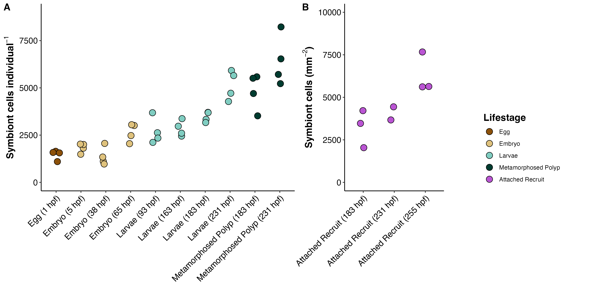

Script to analyze larval size, symbiont density, and examine correlations between physiological responses.  

# **Setup**  

Set up workspace, set options, and load required packages.    
```{r}
knitr::opts_chunk$set(echo = TRUE, warning = FALSE, message = FALSE)
```

```{r setup, include = FALSE}
## install packages if you dont already have them
if (!require("tidyverse")) install.packages("tidyverse")
if (!require("ggplot2")) install.packages("ggplot2")
if (!require("RColorBrewer")) install.packages("RColorBrewer")
if (!require("car")) install.packages("car")
if (!require("emmeans")) install.packages("emmeans")
if (!require("multcomp")) install.packages("multcomp")
if (!require("knitr")) install.packages("knitr")
if (!require("kableExtra")) install.packages("kableExtra")
if (!require("lme4")) install.packages("lme4")
if (!require("GGally")) install.packages("GGally")
if (!require("lmerTest")) install.packages("lmerTest")
if (!require("cowplot")) install.packages("cowplot")

# load packages
library(tidyverse)
library(ggplot2)
library(RColorBrewer)
library(car)
library(emmeans)
library(multcomp)
library(knitr)
library(kableExtra)
library(lme4)
library(GGally)
library(lmerTest)
library(cowplot)
library(Hmisc)
```


# **1. Larval Volume**  

Volume is calculated as an elliptical sphere using the length and width measurements of each individual.  

## Import and manipulate data
```{r}
# Larval size data
size <- read_csv("Mcap2020/Data/Physiology/Size/larval_volume.csv")

#metadata
metadata <- read_csv("Mcap2020/Data/lifestage_metadata.csv")

# select columns
size <- size %>%
  dplyr::select(tube.ID, code, replicate, volume)%>%
  drop_na() #remove na's that could not be measured

size$replicate<-as.factor(size$replicate)
size$tube.ID<-as.factor(size$tube.ID)
size$code<-as.factor(size$code)

size$hpf<-metadata$hpf[match(size$code, metadata$code)]
size$group<-metadata$group[match(size$code, metadata$code)]
size$lifestage<-metadata$lifestage[match(size$code, metadata$code)]

#change metamorphosed recruit to metamorphosed polyp 
size$group <- if_else(size$group == "Metamorphosed Recruit", "Metamorphosed Polyp", size$group)
size$lifestage <- if_else(size$lifestage == "Metamorphosed Recruit (231 hpf)", "Metamorphosed Polyp (231 hpf)", size$lifestage)
size$lifestage <- if_else(size$lifestage == "Metamorphosed Recruit (183 hpf)", "Metamorphosed Polyp (183 hpf)", size$lifestage)

size$hpf <- as.factor(size$hpf)
size$group <- as.factor(size$group)
size$lifestage <- as.factor(size$lifestage)
```

Prep data frame.   
```{r}
# Calculate mean counts for each sample
size <- size %>%
  dplyr::select(tube.ID, lifestage, replicate, volume, hpf, group, code)%>%
  drop_na()
```

## Plotting  

Plot data with mean and standard error for each lifestage.  
```{r}
size %>%
  ggplot(aes(x = hpf, y = volume, color = group)) +
  labs(x = "",y = "Mean Larval Volume (mm^3)") +
geom_jitter(width = 0.1) +                                            # Plot all points
  stat_summary(fun.data = mean_cl_normal, fun.args = list(mult = 1),    # Plot standard error
               geom = "errorbar", color = "black", width = 0.5) +
  stat_summary(fun = mean, geom = "point", color = "black") + # Plot mean
  theme_classic()
```

Present means and standard error of each group and save summary table

```{r}
size%>%
  group_by(lifestage, hpf)%>%
  summarise(n=length(volume),
            Mean=format(round(mean(volume), 3), 3), 
            SE=format(round(sd(volume)/sqrt(length(volume)),3),3))%>%
  rename(Lifestage=lifestage, HPF=hpf)%>%
  kbl(caption="Descriptive statistics of larval volume across ontogeny")%>%
  kable_classic(full_width=FALSE, html_font="Arial")%>%
  row_spec(0, bold = TRUE) 

#need to output to csv 
size%>%
  group_by(lifestage, hpf)%>%
  summarise(n=length(volume),
            Mean=format(round(mean(volume), 3), 3), 
            SE=format(round(sd(volume)/sqrt(length(volume)),3),3))%>%
  rename(Lifestage=lifestage, HPF=hpf)%>%
  write_csv(., "Mcap2020/Output/Physiology/larval_volume_table.csv")
```


Plot data as a scatterplot   
```{r}
size$hpf<-as.factor(size$hpf)
size_plot<-size %>%
    ggplot(., aes(x = hpf, y = volume)) +
    #geom_boxplot(outlier.size = 0) +
    geom_smooth(method="loess", se=TRUE, fullrange=TRUE, level=0.95, color="black") +
    geom_point(aes(fill=group, group=group), pch = 21, size=4, position = position_jitterdodge(0.1)) + 
    xlab("Hours Post-Fertilization") + 
    scale_fill_manual(name="Lifestage", values=c("#8C510A", "#DFC27D","#80CDC1", "#003C30"))+
    ylab(expression(bold(paste("Volume (mm"^3, ")"))))+
    ylim(0,1)+
    theme_classic() + 
    theme(
      legend.position="right",
      axis.title=element_text(face="bold", size=14),
      axis.text=element_text(size=12, color="black"), 
      legend.title=element_text(face="bold", size=14), 
      legend.text=element_text(size=12)
      ); size_plot

#EGG: #8C510A
#EMBRYO: #DFC27D
#LARVAE: #80CDC1
#RECRUIT: #003C30
```

## Plot data as box plot  
```{r}
size_plot2<-size %>%
    ggplot(., aes(x = hpf, y = volume)) +
    geom_boxplot(aes(color=group), outlier.size = 0, lwd=1) +
    geom_point(aes(fill=group), pch = 21, size=2, position = position_jitterdodge(0.1)) + 
    xlab("Hours Post-Fertilization") + 
    scale_fill_manual(name="Lifestage", values=c("#8C510A", "#DFC27D","#80CDC1", "#003C30"))+
    scale_color_manual(name="Lifestage", values=c("#8C510A", "#DFC27D","#80CDC1", "#003C30"))+
    ylab(expression(bold(paste("Volume (mm"^3, ")"))))+
    ylim(0, 0.6)+
    theme_classic() + 
    #geom_text(label="A", x=1, y=2500, size=4, color="black")+ #egg
    #geom_text(label="A", x=2, y=2500, size=4, color="black")+ #embryo 1
    #geom_text(label="A", x=3, y=2500, size=4, color="black")+ #larvae 1
    #geom_text(label="AB", x=4, y=4100, size=4, color="black")+ #larvae 2
    #geom_text(label="AB", x=5, y=4100, size=4, color="black")+ #larvae 3
    #geom_text(label="AB", x=6, y=4100, size=4, color="black")+ #larvae 4
    #geom_text(label="BC", x=6.8, y=4500, size=4, color="black")+ #larvae 5
    #geom_text(label="CD", x=7.2, y=6500, size=4, color="black")+ #recruit 1
    #geom_text(label="D", x=7.8, y=6500, size=4, color="black")+ #larvae6
    #geom_text(label="D", x=8.2, y=8700, size=4, color="black")+ #recruit2
    theme(
      legend.position="right",
      axis.title=element_text(face="bold", size=14),
      axis.text=element_text(size=12, color="black"), 
      legend.title=element_text(face="bold", size=14)
      ); size_plot2

ggsave(plot=size_plot2, "Mcap2020/Figures/Physiology/size.png",height=8, width=8)
```

## Statistical analysis  

Run lmer on cells per larvae by sampling point, specified by sequence of samples taken (life stage, hpf). Use tube ID as random effect.       
```{r}
size_model<-lmer(volume~lifestage + (1|tube.ID), data=size)
summary(size_model)
qqPlot(residuals(size_model))
leveneTest(residuals(size_model)~lifestage, data=size)
anova(size_model, type=2)
```

Violation in normality and variance assumptions. Conduct non-parametric test (Kruskal Wallis).  

```{r}
kruskal.test(volume~lifestage, data=size)
```

Significant difference in size between lifestages.   

View posthoc comparisons for differences between lifestages.  

```{r}
emm = emmeans(size_model, ~ lifestage)
cld(emm, Letters=c(LETTERS)) #letter display
pairs(emm)
```


# **2. Symbiont Density**  

## Symbiont density per individual  

### Import and manipulate data  
```{r}
# Cell count data
sym_counts <- read_csv("Mcap2020/Data/Physiology/CellDensity/symbiont.counts.csv")

sym_counts<-sym_counts%>%
  rename(code=lifestage)
```

Calculate cells and normalize to either planar size (eggs through metamorphosed recruits) or surface area (attached recruits)   
```{r}
# Calculate mean counts for each sample
df <- sym_counts %>%
  dplyr::select(tube.ID, num.squares, matches("count[1-6]")) %>%
  gather("rep", "count", -tube.ID, -num.squares) %>%
  group_by(tube.ID, num.squares) %>%
  summarise(mean_count = mean(count, na.rm = TRUE))

#match in identifying information
df$code<-sym_counts$code[match(df$tube.ID, sym_counts$tube.ID)]
df$total.volume.ul<-sym_counts$total.volume.ul[match(df$tube.ID, sym_counts$tube.ID)]
df$num.individuals<-sym_counts$num.individuals[match(df$tube.ID, sym_counts$tube.ID)]
df$surface.area<-sym_counts$surface.area[match(df$tube.ID, sym_counts$tube.ID)]

#add in metadata
df$hpf<-metadata$hpf[match(df$code, metadata$code)]
df$group<-metadata$group[match(df$code, metadata$code)]
df$lifestage<-metadata$lifestage[match(df$code, metadata$code)]

df$group <- if_else(df$group == "Metamorphosed Recruit", "Metamorphosed Polyp", df$group)
df$lifestage <- if_else(df$lifestage == "Metamorphosed Recruit (231 hpf)", "Metamorphosed Polyp (231 hpf)", df$lifestage)
df$lifestage <- if_else(df$lifestage == "Metamorphosed Recruit (183 hpf)", "Metamorphosed Polyp (183 hpf)", df$lifestage)


# Normalize counts by homogenate volume and surface area
df <- df %>%
  mutate(cells.mL = mean_count * 10000 / num.squares,
         cells = cells.mL * (total.volume.ul/1000),
         cells.ind = cells / num.individuals, 
         cells.mm = cells / surface.area)

sym_counts<-df
```

### Plotting  

Plot data with mean and standard error for larvae through metamorphosis (these counts have cells/individual). Plot attached recruits separately, these values are in cells per mm2. We will plot cells per unit surface area for all stages in later analyses.   

Display cells per individual.  
```{r}
sym_counts %>%
  filter(!group=="Attached Recruit")%>%
  ggplot(aes(x = lifestage, y = cells.ind, color = group)) +
  labs(x = "",y = "Cell Density per larva") +
geom_jitter(width = 0.1) +                                            # Plot all points
  stat_summary(fun.data = mean_cl_normal, fun.args = list(mult = 1),    # Plot standard error
               geom = "errorbar", color = "black", width = 0.5) +
  stat_summary(fun = mean, geom = "point", color = "black") + # Plot mean
  theme_classic()
```

Display cell density per mm2 in attached recruit plugs. Plug 1 = 48 hps, Plug 2 = 72 hps, Plug 3 = 96 hps   
```{r}
sym_counts %>%
  filter(group=="Attached Recruit")%>%
  ggplot(aes(x = lifestage, y = cells.mm, color = lifestage)) +
  labs(x = "",y = "Cell Density per mm2") +
geom_jitter(width = 0.1) +                                            # Plot all points
  #stat_summary(fun.data = mean_cl_normal, fun.args = list(mult = 1),    # Plot standard error
               #geom = "errorbar", color = "black", width = 0.5) +
  #stat_summary(fun.y = mean, geom = "point", color = "black") + # Plot mean
  theme_classic()
```

Present means and standard error of each group and save summary table.  

```{r}
sym_counts%>%
  group_by(group, hpf, lifestage)%>%
  summarise(n=length(cells.ind),
            Mean=format(round(mean(cells.ind), 0), 0), 
            SE=format(round(sd(cells.ind)/sqrt(length(cells.ind)),0),0))%>%
  rename(Lifestage=group, HPF=hpf)%>%
  kbl(caption="Descriptive statistics of Symbiodiniaceae cell densities per larva across ontogeny")%>%
  kable_classic(full_width=FALSE, html_font="Arial")%>%
  row_spec(0, bold = TRUE) 

sym_counts%>%
  group_by(group, hpf, lifestage)%>%
  summarise(n=length(cells.mm),
            Mean=format(round(mean(cells.mm), 0), 0), 
            SE=format(round(sd(cells.mm)/sqrt(length(cells.mm)),0),0))%>%
  rename(Lifestage=group, HPF=hpf)%>%
  kbl(caption="Descriptive statistics of Symbiodiniaceae cell densities per mm2 across ontogeny")%>%
  kable_classic(full_width=FALSE, html_font="Arial")%>%
  row_spec(0, bold = TRUE) 

#need to output to csv 
sym_counts%>%
  group_by(group, hpf, lifestage)%>%
  summarise(n=length(cells.ind),
            Mean=format(round(mean(cells.ind), 0), 0), 
            SE=format(round(sd(cells.ind)/sqrt(length(cells.ind)),0),0))%>%
  rename(group=group, HPF=hpf)%>%
  write_csv(., "Mcap2020/Output/Physiology/cell_density_table.csv")
```

Plot data as a scatterplot   
```{r}
sym_counts$hpf<-as.numeric(as.character(sym_counts$hpf))

symb_plot<-sym_counts %>%
    filter(!group=="Attached Recruit")%>%
    droplevels()%>%
    ggplot(., aes(x = hpf, y = cells.ind)) +
    #geom_boxplot(outlier.size = 0) +
    geom_smooth(method="lm", se=TRUE, fullrange=TRUE, level=0.95, color="black") +
    geom_point(aes(fill=group, group=group), pch = 21, size=4, position = position_jitterdodge(5)) + 
    xlab("Hours Post-Fertilization") + 
    scale_fill_manual(name="Lifestage", values=c("#8C510A", "#DFC27D","#80CDC1", "#003C30"))+
    ylab(expression(bold(paste("Symbiont cells individual"^-1))))+
    ylim(0,9000)+
    theme_classic() + 
    theme(
      legend.position="right",
      axis.title=element_text(face="bold", size=14),
      axis.text=element_text(size=12, color="black"), 
      legend.title=element_text(face="bold", size=14), 
      legend.text=element_text(size=12)
      ); symb_plot

#EGG: #8C510A
#EMBRYO: #DFC27D
#LARVAE: #80CDC1
#RECRUIT: #003C30
#ATTACHED: #BA55D3

```

Plot data as box plot  
```{r}
symb_plot2<-sym_counts %>%
    filter(!group=="Attached Recruit")%>%
    droplevels()%>%
    ggplot(., aes(x = as.factor(hpf), y = cells.ind)) +
    geom_boxplot(aes(color=group), outlier.size = 0, lwd=1) +
    #geom_smooth(method="loess", se=TRUE, fullrange=TRUE, level=0.95, color="black") +
    geom_point(aes(fill=group), pch = 21, size=4, position = position_jitterdodge(0.2)) + 
    xlab("Hours Post-Fertilization") + 
    scale_fill_manual(name="Lifestage", values=c("#8C510A", "#DFC27D","#80CDC1", "#003C30"))+
    scale_color_manual(name="Lifestage", values=c("#8C510A", "#DFC27D","#80CDC1", "#003C30"), guide="none")+
    ylab(expression(bold(paste("Symbiont cells individual"^-1))))+
    ylim(0,9000)+
    theme_classic() + 
    theme(
      legend.position="right",
      axis.title=element_text(face="bold", size=14),
      axis.text=element_text(size=12, color="black"), 
      legend.title=element_text(face="bold", size=14)
      ); symb_plot2

```

### Statistical analysis  

Run ANOVA on cells per larvae by sampling point, specified by sequence of samples taken (life stage, hpf).    

```{r}
sym_ind_model_data<-sym_counts%>%
      filter(!group=="Attached Recruit")%>%
      droplevels()

sym_ind_model<-aov(cells.ind~lifestage, data=sym_ind_model_data)
summary(sym_ind_model)
qqPlot(residuals(sym_ind_model))
leveneTest(residuals(sym_ind_model)~lifestage, data=sym_ind_model_data)
```

Both normality and homogeneity of variance pass.   

There is a significant effect of lifestage on cell densities. View posthoc comparisons for differences between lifestages.  

```{r}
emm = emmeans(sym_ind_model, ~ lifestage)
cld(emm, Letters=c(LETTERS)) #letter display
pairs(emm)
```

Output data to file.  

```{r}
sym_counts %>%
  write_csv(., file = "Mcap2020/Output/Physiology/calculated_densities.csv")
```


## Symbiont density per unit size  

### Data manipulation and correlation  

First, test for correlation between symbiont cell density and larval volume to see if there is a relationship.  

Generate data frame with summarized size and cell density information for each time point from eggs to metamorphosed recruits, because we have data for volume and counts for each sample. We do not include attached recruits here yet, because we cannot calculate densities per individual.   

```{r}
#read in data frame generated in previous chunk 
sym_counts<-sym_counts%>%
  dplyr::select(tube.ID, lifestage, group, hpf, cells.ind, cells.mm)

#grab size data
volume<-size%>%
  group_by(tube.ID)%>%
  summarise(mean_volume=mean(volume, na.rm=TRUE))

volume$tube.ID<-as.factor(volume$tube.ID)
sym_counts$hpf<-as.factor(sym_counts$hpf)

corr<-left_join(sym_counts, volume)
```

Generate number of symbiont cells per mm^3 area for each tube.    
```{r}
corr<-corr%>%
  mutate(mean_volume_2=mean_volume*2)%>%
  mutate(counts_volume=cells.ind/mean_volume)%>%
  mutate(counts_volume=ifelse(is.na(counts_volume), cells.mm, counts_volume)) #add attached recruit data already calculated as cells per mm2
```

Plot correlation between cell counts (cells per individual) and volume (mm^3).  

```{r}
correlation<-corr %>%
    filter(!group=="Attached Recruit")%>%
    ggplot(., aes(x = mean_volume, y = cells.ind)) +
    #geom_smooth(method="lm", se=TRUE, fullrange=TRUE, level=0.95, color="black", fill="gray") +
    geom_point(aes(fill=group), pch = 21, size=4) + 
    xlab(expression(bold(paste("Larval Size (mm"^2, ")")))) + 
    scale_fill_manual(name="Lifestage", values=c("#8C510A", "#DFC27D","#80CDC1", "#003C30"))+
    scale_color_manual(name="Lifestage", values=c("#8C510A", "#DFC27D","#80CDC1", "#003C30"))+
    xlab(expression(bold(paste("Individual Volume (mm"^3, ")"))))+
    ylab(expression(bold(paste("Symbiont cells individual"^-1))))+
    #ylim(0, 9000)+
    theme_classic() + 
    theme(
      legend.position="none",
      axis.title=element_text(face="bold", size=14),
      axis.text=element_text(size=12, color="black"), 
      legend.title=element_text(face="bold", size=14)
      ); correlation
```

Test relationship with a spearman correlation.  

```{r}
cor.test(corr$mean_volume, corr$cells.ind, method=c("spearman"))
```

There is not a significant correlation between volume and symbiont density.   

### Plotting  

Plot cells per mm^3 as a boxplot.    

```{r}
#order for creating a legend for all plots 
corr$group <- factor(corr$group, levels = c("Egg", "Embryo", "Larvae", "Metamorphosed Polyp", "Attached Recruit"))

cells_size_plot<-corr %>%
    filter(!group=="Attached Recruit")%>%
    ggplot(., aes(x = hpf, y = counts_volume)) +
    geom_boxplot(aes(color=group), outlier.size = 0, lwd=1) +
    geom_point(aes(fill=group), pch = 21, size=4, position = position_jitterdodge(0.4)) + 
    xlab("Hours Post-Fertilization") + 
    scale_fill_manual(name="Lifestage", values=c("#8C510A", "#DFC27D","#80CDC1", "#003C30", "#BA55D3"), guide="none")+
    scale_color_manual(name="Lifestage", values=c("#8C510A", "#DFC27D","#80CDC1", "#003C30", "#BA55D3"))+
    ylab(expression(bold(paste("Volume-normalized cell density (mm"^-3,")"))))+
    #ylim(2000, 35000)+
    theme_classic() + 
    theme(
      legend.position="top",
      axis.title=element_text(face="bold", size=14),
      axis.text=element_text(size=12, color="black"), 
      legend.title=element_text(face="bold", size=14)
      ); cells_size_plot

#making a plot with a legend for use later on 
#we are NOT using this plot for comparisons due to different units for attached recruits that cannot be compared.  
legend_plot<-corr %>%
    #filter(!group=="Attached Recruit")%>%
    ggplot(., aes(x = hpf, y = counts_volume)) +
    geom_boxplot(aes(color=group), outlier.size = 0, lwd=1) +
    geom_point(aes(fill=group), pch = 21, size=4, position = position_jitterdodge(0.4)) + 
    xlab("Hours Post-Fertilization") + 
    scale_fill_manual(name="Lifestage", values=c("#8C510A", "#DFC27D","#80CDC1", "#003C30", "#BA55D3"), guide="none")+
    scale_color_manual(name="Lifestage", values=c("#8C510A", "#DFC27D","#80CDC1", "#003C30", "#BA55D3"))+
    ylab(expression(bold(paste("Symbiont cells mm"^-3))))+
    #ylim(2000, 35000)+
    theme_classic() + 
    theme(
      legend.position="right",
      axis.title=element_text(face="bold", size=14),
      axis.text=element_text(size=12, color="black"), 
      legend.title=element_text(face="bold", size=14)
      )

```

Plot as linear relationship.  

```{r}
cells_size_plot2<-corr %>%
    filter(!group=="Attached Recruit")%>%
    ggplot(., aes(x = as.numeric(as.character(hpf)), y = counts_volume)) +
    geom_point(aes(fill=group, group=group), pch = 21, size=4, position = position_jitterdodge(0.4)) + 
    geom_smooth(method="lm", se=TRUE, fullrange=TRUE, level=0.95, color="black") +
    xlab("Hours Post-Fertilization") + 
    scale_fill_manual(name="Lifestage", values=c("#8C510A", "#DFC27D","#80CDC1", "#003C30", "#BA55D3"), guide="none")+
    scale_color_manual(name="Lifestage", values=c( "#8C510A", "#DFC27D","#80CDC1", "#003C30", "#BA55D3"))+
    ylab(expression(bold(paste("Symbiont cells mm"^-3))))+
    #ylim(2000, 35000)+
    theme_classic() + 
    theme(
      legend.position="right",
      axis.title=element_text(face="bold", size=14),
      axis.text=element_text(size=12, color="black"), 
      legend.title=element_text(face="bold", size=14)
      ); cells_size_plot2
```

Analyze differences in normalized cell counts by timepoint. 

```{r}
model<-corr%>%
  filter(!group=="Attached Recruit")%>%
  droplevels()%>%
  aov(counts_volume~lifestage, data=.)

qqPlot(residuals(model))

corr%>%
  filter(!group=="Attached Recruit")%>%
  droplevels()%>%
  leveneTest(residuals(model)~lifestage, data=.)

summary(model)
```

View posthoc differences.  
```{r}
emm = emmeans(model, ~ lifestage)
cld(emm, Letters=c(LETTERS)) #letter display
pairs(emm)
```

Generate summary table of descriptive statistics.  

```{r}
#need to output to csv 
corr%>%
  group_by(group, hpf, lifestage)%>%
  filter(!group=="Attached Recruit")%>%
  droplevels()%>%
  summarise(n=length(counts_volume),
            Mean_sym_mm3=format(round(mean(counts_volume), 0), 0), 
            SE=format(round(sd(counts_volume)/sqrt(length(counts_volume)),0),0))%>%
  rename(Lifestage=group, HPF=hpf)%>%
  write_csv(., "Mcap2020/Output/Physiology/normalized_size_cells_summary.csv")
```

### Attached Recruit Plotting  

Plot as box plot.  

```{r}
recruit_size_plot<-corr %>%
    filter(group=="Attached Recruit")%>%
    ggplot(., aes(x = hpf, y = counts_volume)) +
    geom_boxplot(aes(color=group), outlier.size = 0, lwd=1) +
    geom_point(aes(fill=group), pch = 21, size=4, position = position_jitterdodge(0.4)) + 
    xlab("Hours Post-Fertilization") + 
    scale_fill_manual(name="Lifestage", values=c("#BA55D3"), guide="none")+
    scale_color_manual(name="Lifestage", values=c("#BA55D3"))+
    ylab(expression(bold(paste("Surface area-normalized cell density (mm"^-2,")"))))+
    #ylim(2000, 35000)+
    theme_classic() + 
    theme(
      legend.position="top",
      axis.title=element_text(face="bold", size=14),
      axis.text=element_text(size=12, color="black"), 
      legend.title=element_text(face="bold", size=14)
      ); recruit_size_plot
```

View summary of symbiont densities per unit surface area.  

```{r}
#need to output to csv 
corr%>%
  group_by(group, hpf, lifestage)%>%
  filter(group=="Attached Recruit")%>%
  droplevels()%>%
  summarise(n=length(counts_volume),
            Mean_sym_mm2=format(round(mean(counts_volume), 0), 0), 
            SE=format(round(sd(counts_volume)/sqrt(length(counts_volume)),0),0))%>%
  rename(Lifestage=group, HPF=hpf)%>%
  write_csv(., "Mcap2020/Output/Physiology/normalized_size_cells_summary_attached.csv")
```

Test differences with a kruskal wallis test.  

```{r}
corr%>%
  group_by(group, hpf, lifestage)%>%
  filter(group=="Attached Recruit")%>%
  droplevels()%>%
  kruskal.test(counts_volume~hpf, data=.)
```

# **3. Generate Figures**  

Generate physiology panel with all variables of interest.    

```{r}
# extract the legend from one of the plots
legend <- get_legend(
  # create some space to the left of the legend
  cells_size_plot + theme(legend.position="right") + theme(legend.box.margin = margin(1,1,1,1))
)

#remove legends from plots  
size_plot2<-size_plot2+theme(legend.position="none")
symb_plot2<-symb_plot2+theme(legend.position="none")
cells_size_plot_l<-cells_size_plot+theme(legend.position="none")

#assemble plots
all_plots<-plot_grid(size_plot2, symb_plot2, cells_size_plot_l, labels = c("A", "B", "C"), label_size=18, ncol=3, nrow=1, rel_heights= c(1,1,1), rel_widths = c(1,1,1), align="h")

all_plots_legend<-plot_grid(all_plots, legend, rel_widths = c(4, 0.5), ncol=2, nrow=1)

ggsave(file="Mcap2020/Figures/Physiology/Physiology_figure_all.png", all_plots_legend, dpi=300, width=24, height=6, units="in")

```


Generate a figure that has just the symbiont density metrics of interest: counts per individual. 

```{r}
# extract the legend from one of the plots
legend <- get_legend(
  # create some space to the left of the legend
  legend_plot +  theme(legend.box.margin = margin(1,1,1,1))
)

symb_plot2b<-symb_plot2+theme(legend.position="none")+ theme(axis.title=element_text(size=14, face="bold"))
recruit_size_plot2<-recruit_size_plot+theme(legend.position="none")+theme(axis.title=element_text(size=10))+ylim(500,9000)

target_plots<- ggdraw(symb_plot2b) +
  draw_plot(recruit_size_plot2, .16, .6, .35, .35) +
  draw_plot_label(
    c("A", "B"),
    c(0.05, 0.2),
    c(1, 0.96),
    size = 16
  );target_plots

target_plots_legend<-plot_grid(symb_plot2b, legend, rel_widths = c(4, 1.2), ncol=2, nrow=1)

ggsave(file="Mcap2020/Figures/Physiology/Physiology_figure_densities.png", target_plots_legend, dpi=300, width=8, height=6, units="in")

```

  

Generate a figure that has just the symbiont density metrics of interest: volume normalized counts. 

```{r}
# extract the legend from one of the plots
legend <- get_legend(
  # create some space to the left of the legend
  legend_plot +  theme(legend.box.margin = margin(1,1,1,1))
)

cells_size_plotb<-cells_size_plot+theme(legend.position="none")+ theme(axis.title=element_text(size=14, face="bold"))+ylim(2000,85000)
recruit_size_plot2<-recruit_size_plot+theme(legend.position="none")+theme(axis.title=element_text(size=14))+ylim(0,8000)

#target_plots2<- ggdraw(cells_size_plotb) +
  #draw_plot(recruit_size_plot2, .16, .6, .35, .35) +
  #draw_plot_label(
   # c("A", "B"),
  #c(0.05, 0.2),
   # c(1, 0.96),
    #size = 16
  #);target_plots2

target_plots_legend2<-plot_grid(cells_size_plotb, recruit_size_plot2, legend, labels=c("A", "B"), rel_widths = c(3,1.3, 1), ncol=3, nrow=1)

ggsave(file="Mcap2020/Figures/Physiology/Physiology_figure_densities_volume.png", target_plots_legend2, dpi=300, width=10, height=6, units="in")

```


  